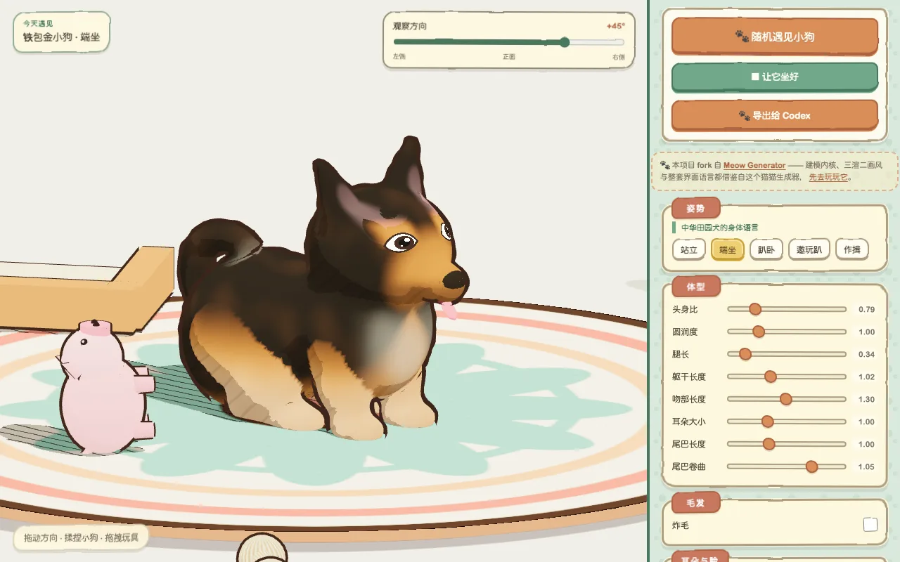
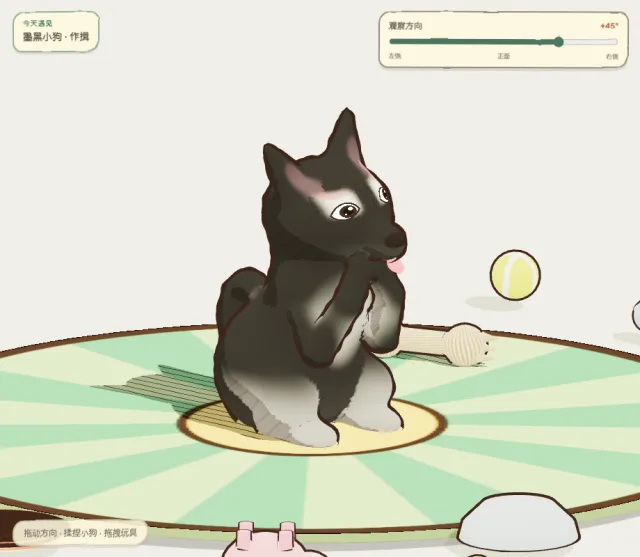
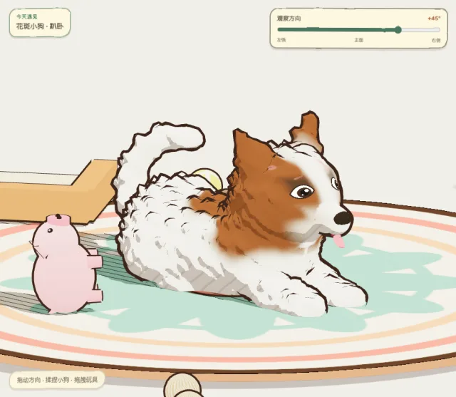
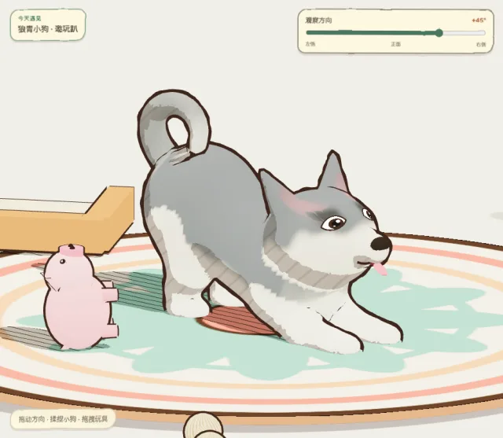

<div align="center">

# 汪汪生成器 · Woof Generator

**Build your own Chinese village dog in 3D, one slider at a time.** A procedural toon-shaded dog generator in Three.js.<br>
**拖一下滑杆，长出一只你自己的中华田园犬。** 用 Three.js 写的程序化三渲二小狗生成器。

<a href="https://guigulaoshi.github.io/Woof-Generator/"></a>

<a href="https://guigulaoshi.github.io/Woof-Generator/"></a>

<table>
  <tr>
    <td width="33%"></td>
    <td width="33%"></td>
    <td width="33%"></td>
  </tr>
  <tr>
    <td align="center">作揖 · 墨黑<br><sub>Paws together · black</sub></td>
    <td align="center">趴卧 · 花斑 · 炸毛<br><sub>Lying down · patched · fluffy</sub></td>
    <td align="center">邀玩趴 · 狼青<br><sub>Play bow · wolf grey</sub></td>
  </tr>
</table>

<sub>截图取自线上网页 · Screenshots taken from the live site. 界面为中文 · The UI is in Chinese.</sub>

</div>

用 Three.js 写的程序化中华田园犬生成器。每拖一下滑杆，整只狗都会按新的参数
重新长一遍——形状是「造」出来的，不是把现成模型拉伸出来的。

A procedural Chinese village dog (中华田园犬) generator. Every slider rebuilds the whole dog from its
parameters, so the shape is modelled, not stretched from a fixed mesh.

▶ 在线试玩 / Play：<https://guigulaoshi.github.io/Woof-Generator/><br>
▶ GitHub 项目地址：<https://github.com/guigulaoshi/Woof-Generator>

> **本项目 fork 自 [Meow Generator](https://github.com/ringhyacinth/Meow-Generator)**<br>
> 建模内核、三渲二画风与整套界面语言都借鉴自那个猫猫生成器，请先去支持原作：<br>
> ▶ 在线试玩：<https://ringhyacinth.github.io/Meow-Generator/><br>
> ▶ GitHub 项目地址：<https://github.com/ringhyacinth/Meow-Generator>
>
> *Forked from [Meow Generator](https://github.com/ringhyacinth/Meow-Generator) by ringhyacinth: the modelling core,
> toon style and interface all come from that cat generator. Please go and support the original first.*

## 本地运行 · Run locally

```bash
npm install
npm run dev      # http://localhost:8792
```

不想开服务器就 `npm run build`，然后直接双击 `woof-standalone.html`：CSS 和
JavaScript 全部内嵌，`file://` 打开即用，不依赖任何外部资源。

## 它是怎么做出来的

一条完整的 SDF 管线，和三渲二的画法：

1. **SDF 图元 + smooth min 融合** —— 球和圆头锥按参数摆成一只狗的解剖结构
2. **Surface Nets 网格化** —— 把这个隐式曲面转成三角网格
3. **三渲二着色** —— 二分色阶 + 手绘排线 + 反壳描边 + 正交镜头

因为几何每次都是现算的，「腿长」调到 0.08 或者 2.6，得到的都是一只完整、不穿模
的狗，而不是一张被拉花的蒙皮。

## 特点

- **五种姿势**：站立、端坐、趴卧、邀玩趴、作揖。作揖时两只前爪是真的合在一起的。
- **三种耳型 × 两种耳尖**：立耳 / 垂耳 / 折耳说的是耳朵怎么长在头上，尖耳 / 圆耳
  说的是耳尖形状——两条轴独立，六种组合都成立，再叠上耳朵大小滑杆。
- **按狗的解剖来做**。楔形头骨（颅顶偏平、额头和鼻梁之间有明显的止部）、
  突出的长口吻加圆鼻头、横向的杏仁眼配圆瞳、后腿的膝—跗二段折线、深胸收腹的
  腰线、卷在背上的尾巴、吻部两侧的触须点。
- **毛色只染背上那块皮**。花色分三层：`saddle` 鞍背（主色盘驱动）、`under`
  腹部与四肢底色、`accent` 眉点与点缀。鞍背的位置由沿脊柱的（前后位置，绕脊柱
  角度）决定，所以换姿势也会长在解剖学正确的地方。九种花色都取自真实存在的
  中华田园犬色型：大黄、黑背、铁包金、狼青、赤红、花斑、虎斑、奶白、墨黑。
- **炸毛**：沿法线的多频噪声抬升，脸部有保护罩，毛刺不会扎穿口吻。
- **软的舌头**：多边形搭出来的一片软肉，中轴线每帧重算，狗一摇尾巴舌头就跟着甩。
- **玩具**：磨牙骨、网球、飞盘、编织绳结、不锈钢饭碗、吱吱猪、被叼走的拖鞋，
  外加三面围边的狗窝垫，全部带刚体物理、可以抓起来拖拽。
- **眼睛跟着鼠标走**；揉捏身体有软体形变和回弹，摸脑袋只会弹一下。
- **导出给 Codex**：把当前这只狗打包成参数 JSON + 定妆照 PNG + 一段可以直接
  粘给编码助手的说明。不连接任何服务。

花色是画在顶点上的，所以定稿网格用 0.016 的 SDF 采样间距；拖滑杆时先出一版
0.045 的粗网格保证跟手，松手 180ms 后再补细网格。

## 测试

```bash
npm run test:dog          # 60 组「姿势 × 耳型 × 极端体型」+ 花色行为
npm run test:standalone   # 离线单文件包的自包含性
```

`test:dog` 会真的把狗生成出来：逐一检查网格没有塌陷、没有穿地、没有 NaN 顶点色；
再对比「只改背毛色」和「只改底色」两次生成的顶点色，确认主色确实只染在背上那一
块，而且它的平均高度明显高于底色区域。

## 致谢

这个项目 fork 自 [Meow Generator](https://github.com/ringhyacinth/Meow-Generator)
（程序化 3D 小猫生成器）。SDF 建模内核、Surface Nets 网格化、三渲二着色、手绘
排线、软体戳捏、玩具物理和整套界面版式，都源自那个项目；本项目把角色从猫换成了
中华田园犬，重写了解剖结构、花色系统、待机动作和玩具组，并作为独立项目发布。

如果你喜欢这里的画风，请先去给原项目点个 star。

## 许可

沿用上游的 PolyForm Noncommercial 1.0.0，见 [LICENSE](LICENSE)。
商业使用请联系原作者。

## 作者 · Made by

guigulaoshi · [itch.io](https://guigulaoshi.itch.io) · [GitHub](https://github.com/guigulaoshi) · [YouTube](https://www.youtube.com/@guigulaoshi) · [X](https://x.com/guigulaoshi) · [TikTok](https://www.tiktok.com/@guigulaoshi) · [抖音](https://www.douyin.com/user/MS4wLjABAAAAmWbEAlX8SvUu3RUFu48ArUSOqK9-2cTOC78Byiqe0GY) · [哔哩哔哩](https://space.bilibili.com/3546730639395688) · [小红书](https://www.xiaohongshu.com/user/profile/6090be480000000001005d88)
